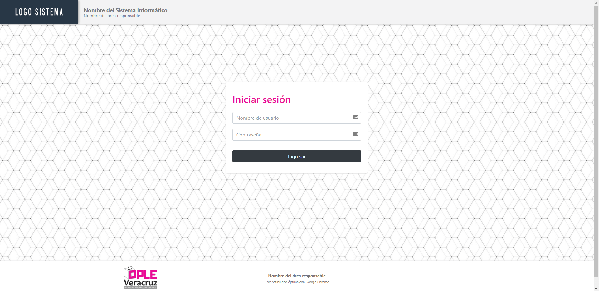

# dashboardclon

_Plantilla de Laravel 5.8 para el desarrollo de aplicaciones del OPLE Veracruz_

# Tabla de Contenidos  

- ### [Comenzando](#comenzando)
- ### [Pre-requisitos](#pre-requisitos)
- ### [Instalación](#instalación)
- ### [Configuración de git](#configuración-de-git)
    - ### [Verificar configuración local](#verificar-configuración-local)
    - ### [Renombrar origin](#renombrar-origin)
    - ### [Crear nuevo origin](#crear-nuevo-origin)
- ### [Correr Proyecto](#correr-proyecto)
- ### [Actualizar Proyecto](#actualizar-proyecto)
    - ### [Bajar cambios de dashboardclon](#bajar-cambios-de-dashboardclon)
    - ### [Arreglar conflictos](#arreglar-conflictos)
- ### [Contribuyendo](#contribuyendo)

## Comenzando 🚀

Estas instrucciones te permitirán obtener una copia de la plantilla para el desarrollo de tu nuevo proyecto en tu máquina local.

Ve a la sección **Contribuyendo** para saber como contribuir a la plantilla con mejoras o correcciones.  

### Pre-requisitos 📋

Para correr el proyecto es necesario tener el entorno de desarrollo configurado correctamente:

- [ ] PHP 7.2
- [ ] Vagrant
- [ ] Laravel Homestead

### Instalación ⚙️

Ingresa a vagrant corriendo `vagrant up` y `vagrant ssh` desde línea de comando o símbolo del sistema abierto como **administrador**:
```
C:\WINDOWS\system32> cd C:\Users\User\homestead
C:\Users\User\homestead> vagrant up
C:\Users\User\homestead> vagrant ssh
```

Clona la plantilla con el nombre de tu nuevo proyecto dentro del directorio **code**, colocando el nombre de tu nuevo proyecto al final del comando de clonar:

```
$ cd code
$ git clone https://gitlab.com/opleveracruz/dashboardclon nuevo-proyecto
```

Agrega la rutas del proyecto y su base de datos a Homestead:

**C:\Users\User\homestead\Homestead.yaml**

```
sites:
 ...
    - map: nuevo-proyecto.test
      to: /home/vagrant/code/nuevo-proyecto/public
      php: "7.2"
 ...
databases:
    - nuevo-proyecto
```

Agrega la el url de tu nuevo proyecto a la lista de hosts:

**C:\Windows\System32\drivers\etc\hosts**
```
...
192.168.10.10		nuevo-proyecto.test

```

Corre `vagrant provision` desde **homestead** para realizar el mapeo de rutas, una vez finalizado este proceso, ingresa nuevamente a vagrant:
```
$ exit
C:\Users\User\homestead> vagrant provision
C:\Users\User\homestead> vagrant ssh
```

Dirígete al directorio de tu proyecto para instalar los paquetes y dependencias de PHP del proyecto:
```
$ cd code/nuevo-proyecto
$ composer install
``` 

Instala los paquetes y dependencias de javascript:
```
$ npm install
$ npm run dev
```

Verifica que el archivo **.env** exista en tu proyecto. Si no existe crea una copia a partir del ejemplo y genera una llave para el proyecto:
```
$ cp .env.example .env
$ php artisan key:generate
```

Asegúrate de configurar el nombre y url de la app así como el ID, llave y contraseña de Pusher correctamente:
```
APP_NAME=nuevo-proyecto
...
APP_URL=http://nuevo-proyecto.test
...
DB_DATABASE=nuevo-proyecto
...
PUSHER_APP_ID=XXXXX
PUSHER_APP_KEY=XXXXX
PUSHER_APP_SECRET=XXXXX
PUSHER_APP_CLUSTER=us2
```

Por último, corre las migraciones junto con el seeder para crear y pre-cargar las tablas de la base de datos:
```
$ php artisan migrate:refresh --seed
```
_Como el .env está configurado como Production, va a preguntar si queremos proseguir con el comando, a lo que debes escribir **yes**_:
``` 
**************************************
*     Application In Production!     *
**************************************
Do you really wish to run this command? (yes/no) [no]:
> yes
```

## Configuración de git 🖇️

Para poder trabajar en tu nuevo proyecto pero aún poder recibir actualizaciones a la plantilla en un futuro, se deben realizar unos cambios a los **remote**, que son _aliases_ de los repositorios a los que se apunta en los comandos `git fetch`, `git pull`, `gut push`, entre otros.

#### Verificar configuración local

Debido a que se pueden realizar cambios de parte de diferentes usuarios en la plantilla, es esencial configurar el nombre de usuario y correo para identificar correctamente a los usuarios en el historial de commits, utiliza el correo que tienes registrado en gitlab:

```
$ git config --global user.name "Mi Nombre"
$ git config --global user.email "micorreo@correo.com"
```
#### Renombrar origin

Cuando escribes el comando `git remote -v` te aparece una lista de los remotes (aliases) y el repositorio (url) al que apuntan:

```
$ git remote -v
origin  https://gitlab.com/opleveracruz/dashboardclon.git (fetch)
origin  https://gitlab.com/opleveracruz/dashboardclon.git (push)
```

Esto quiere decir que cuando utilizas el comando `git fetch origin master` o `git push origin master` estas diciéndole a git que revise o envíe cambios a la rama **master** del repositorio en el url **https://gitlab.com/opleveracruz/dashboardclon.git**, respectivamente.

Por conveniencia y buena práctica el remote **origin** siempre debe ser correspondiente al repositorio de tu proyecto por lo cual en este caso ya no puede ser _~/dashboardclon.git_.

Renombra **origin** a **dashboard** con el comando `git remote rename origin dashboard`

#### Crear nuevo origin 

Crea el un nuevo remote **origin**:

```
$ git remote add origin https://gitlab.com/opleveracruz/nuevo-proyecto.git
```

Verifica que se hayan modificado los remote correctamente con `remote -v`:
```
$ git remote -v
dashboard       https://gitlab.com/opleveracruz/dashboardclon.git (fetch)
dashboard       https://gitlab.com/opleveracruz/dashboardclon.git (push)
origin  https://gitlab.com/opleveracruz/nuevo-proyecto.git (fetch)
origin  https://gitlab.com/opleveracruz/nuevo-proyecto.git (push)

```

## Correr proyecto

Abre tu navegador y dirígete a [http://nuevo-proyecto.test](http://nuevo-proyecto.test). Debes ver una pantalla similar a la siguiente imagen:



## Actualizar proyecto 📡

Asegúrate de estar preparado para actualizar tu proyecto cuando se te notifique o notes cambios en **dashboardclon**.

Para verificar que tu repositorio local está listo para recibir los cambios de la plantilla ejecuta el comando `git status`. Debes ver un mensaje similar al siguiente, donde se indica que no hay nada que guardar y está limpio:

```
$ git status
On branch master
Your branch is up to date with 'origin/master'.

nothing to commit, working tree clean
```

Si te muestra que aún tienes cambios pendientes, asegúrate de guardarlos con los comandos `git add` y `git commit` y enviándolos a tu repositorio con `git push origin` para evitar perder tus avances en caso de que algo no salga como esperado.

#### Bajar cambios de dashboardclon

Corre el comando `git pull dashboard master` para bajar las actualizaciones de la plantilla. Si todo sale bien verás un listado de los cambios:

```
$ git pull dashboard master
...
 file1
 file2
 ...
 N files changed
 create mode ...
 create mode ...

```

En caso de existir un conflicto, en donde los cambios de la plantilla y tus cambios hayan afectado el mismo archivo, verás un mensaje similar al siguiente:

```
$ git pull dashboard master
...
 file1
 file2
 ...
Auto-merging file1.txt
CONFLICT (add/add): merge conflict in file1.txt

Automatic merge failed; fix conflicts and then commit the result.
```

#### Arreglar conflictos

Los conflictos se pueden localizar por los identificadores que git añade a los archivos señalados:
```
#file1.txt

 <<<<<<< HEAD
 Cambio en file1.txt por usuario local
 =======
 Cambio en file1.txt por otro usuario
 >>>>>>> 
```

Los pasos a seguir para resolver el conflicto manualmente son:
* Borrar los identificadores (<<<<<<< HEAD, =======, >>>>>>> ).
* Seleccionar que contenido se debe conservar, según las siguientes opciones:
    * Conservar únicamente tus cambios
        ```
        #file1.txt

        Cambio en file1.txt por usuario local
        ```
    * Conservar únicamente tus cambios
        ```
        #file1.txt

        Cambio en file1.txt por otro usuario
        ```
    * Conservar únicamente tus cambios
        ```
        #file1.txt

        Cambio en file1.txt por usuario local
        Cambio en file1.txt por otro usuario
        ```
De igual manera, se pueden resolver de forma semi-automática en Visual Studio Code o Sublime:
<imagen>

Por último se agregan los archivos y se hace un commit:
```
$ git add .
$ git commit -m "Merge dashboardclon en nuevo-proyecto"
```

Y listo, tu proyecto ya debe estar al corriente con los cambios de la plantilla mientras aún conserva tus avances.

## Contribuyendo 🛠️

Para contribuir a la plantilla **dashboardclon** con mejoras y correcciones, es necesario tener una copia del proyecto corriendo en tu equipo local, diferente a la de tu nuevo-proyecto, donde el remote _origin_ siga apuntando a este repositorio.

Siempre que se quiera hacer un cambio nuevo, es necesario crear una rama que indique el autor y describa de manera corta y eficiente los cambios que pretende realizar esta rama, por ejemplo, `usuario-agregar-plugin`.

Para crear una rama se utiliza el comando `git checkout -b usuario-descripcion-rama`
```
$ git checkout -b usuario-primer-rama
Switched to a new branch 'usuario-primer-rama'
```

Puedes listar las ramas que existen en tu repositorio local con el comando `git branch`. El asterisco indica la rama actual:
```
$ git branch
* usuario-primer-rama
  usuario-segunda-rama
  master
```

Se puede cambiar de rama con el comando `git checkout nombre-rama`:
```
$ git checkout usuario-primer-rama
Switched to branch 'usuario-primer-rama'
```

Una vez en tu rama de trabajo, realiza los cambios que necesitas y sigue el mismo proceso de hacer `git add` y `git commit` para guardar tus avances. Cuando estés listo para mandar tus cambios al repositorio remoto en vez de correr `git push origin master` debes correr `git push origin usuario-primer-rama`. Esto va a crear una nueva rama con el mismo nombre en el repositorio remoto.

En el momento en que creas que tus cambios estan listos para integrarse a **master** debes dirigirte al listado de branches (ramas) en gitlab: [dashboardclon/branches](https://gitlab.com/opleveracruz/dashboardclon/-/branches):

<Imagen>

Presiona el boton **Merge Request**

<Imagen>

**1)** Asegúrate de ingresar un titulo adecuado así como una descripción detallada y justificada de los cambios que estas realizando.

**2)** Asigna a un compañero del equipo para que revise los cambios. Este paso es importante ya que tu compañero podría tener sugerencias de mejoras en tu implementación, detectar errores que no hayas identificado o pedirte una descripción mas detallada en alguna parte de tus cambios.

**3)** Presiona el botón Send Merge Request.

<Imagen>

Una vez aprobado el cambio por tu compañero, la rama se borra automáticamente del repositorio remoto, pero para conservar tu repositorio local limpio también es necesario borrarla ahí. Primero hay que regresar a la rama maestra y después borrar la rama terminada:
```
$ git checkout master

$ git branch -D usuario-primer-rama
Deleted branch usuario-primer-rama (was xxxxxx).
``` 

Como regresamos a la rama maestra, es como si no se hubiera hecho ningún cambio en el repositorio local, por lo que hay que bajar los cambios de __master__ `$ git pull origin master`.

Asegúrate correr `composer update` o `composer update` si agregaste o actualizaste algún componente de PHP, `npm install` si agregaste alguna libreria de javascript y `npm run dev` si actualizaste el css o javascript del proyecto.

Por último, recuerda correr `php artisan cache:clear`, `php artisan config:clear` y `composer dump-autoload` si creaste algúna clase nueva o hiciste cambios en **config/app.php**.


---
⌨️ con ❤️ por la democracia [OPLEVeracruz](https://github.com/opleveracruz) 😊